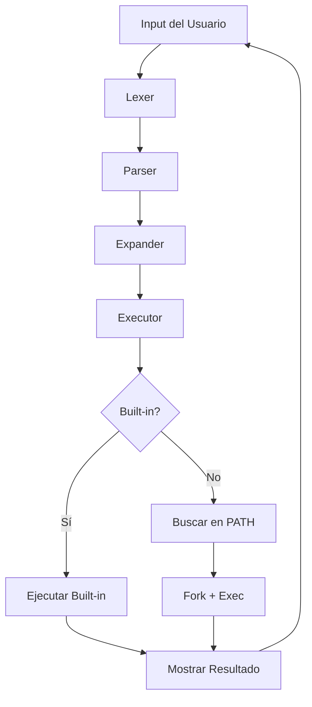

     ________  ________  ________  ___  ___  ________  ________  ________     
    |\   __  \|\   __  \|\   ____\|\  \|\  \|\   __  \|\   ___ \|\   __  \    
    \ \  \|\ /\ \  \|\  \ \  \___|\ \  \\\  \ \  \|\  \ \  \_|\ \ \  \|\  \   
     \ \   __  \ \   __  \ \_____  \ \   __  \ \   __  \ \  \ \\ \ \  \\\  \  
      \ \  \|\  \ \  \ \  \|____|\  \ \  \ \  \ \  \ \  \ \  \_\\ \ \  \\\  \ 
       \ \_______\ \__\ \__\____\_\  \ \__\ \__\ \__\ \__\ \_______\ \_______\
        \|_______|\|__|\|__|\_________\|__|\|__|\|__|\|__|\|_______|\|_______|
                           \|_________|                                       

# minishell

> 🐚 **PROYECTO EDUCATIVO** - Shell básico inspirado en BASH para 42 School

Un intérprete de comandos minimalista implementado en C que replica las funcionalidades básicas de BASH. Este proyecto es parte del currículum de 42 School y está diseñado para enseñar los fundamentos de sistemas operativos, procesos y programación de sistemas.


## 📖 Tabla de Contenidos
1. [Introducción](#introducción)
2. [Funcionalidades Implementadas](#funcionalidades-implementadas)
3. [Instalación y Uso](#instalación-y-uso)
4. [Cómo Funciona BASHado](#cómo-funciona-bashado)
5. [Arquitectura del Código](#arquitectura-del-código)
6. [Limitaciones Conocidas](#limitaciones-conocidas)
7. [Desarrollo y Extensión](#desarrollo-y-extensión)  

## 🚀 Funcionalidades Implementadas

### 🔧 Comandos Built-in
- **`echo`** - Imprime texto con soporte para flag `-n`
- **`cd`** - Cambio de directorio con soporte para rutas relativas y absolutas
- **`pwd`** - Muestra el directorio de trabajo actual
- **`export`** - Gestión de variables de entorno
- **`unset`** - Eliminación de variables de entorno
- **`env`** - Visualización de variables de entorno
- **`exit`** - Terminación del shell con códigos de salida

### 🔗 Funcionalidades del Shell
- **Historial funcional** - Navegación con flechas usando readline
- **Expansión de variables** - Soporte para `$VARIABLE` y `$?`
- **Búsqueda en PATH** - Ejecución automática de ejecutables del sistema
- **Gestión de comillas** - Procesamiento correcto de `'` y `"`
- **Prompt personalizado** - Interfaz similar a BASH

### 🔄 Redirecciones y Pipes
- **`<`** - Redirección de entrada (input)
- **`>`** - Redirección de salida (output)
- **`<<`** - Heredoc (documento embebido)
- **`>>`** - Redirección de salida en modo append
- **`|`** - Pipes para comunicación entre procesos

### 🎛️ Gestión de Señales
- **`Ctrl + C`** - SIGINT (interrupción)
- **`Ctrl + D`** - EOF (fin de archivo)
- **`Ctrl + \`** - SIGQUIT (quit signal)

### 🎯 Características Bonus (en versión bonus)
- **Wildcards** - Soporte para `*` (expansión de nombres de archivo)
- **Operadores lógicos** - `&&` y `||` básicos
- **Paréntesis** - Agrupación de comandos
- **Funcionalidad extendida** del parser y lexer

## ⚠️ Limitaciones del Proyecto

Este es un shell **educativo y básico** con las siguientes limitaciones:

### 🚫 Funcionalidades No Implementadas
- **Sin alias** - No soporta definición de alias de comandos
- **Sin funciones** - No permite definir funciones de shell
- **Sin control de trabajos** - No hay `jobs`, `fg`, `bg`
- **Sin completado automático** - No sugiere comandos o archivos
- **Sin configuración avanzada** - No lee archivos `.bashrc` o similares
- **Sin scripting avanzado** - Loops y condicionales limitados
- **Sin aritmética** - No evalúa expresiones matemáticas

## 🚀 Instalación y Uso

### Prerrequisitos

**macOS:**
```bash
# Instalar readline con Homebrew
brew install readline
```

**Linux (Ubuntu/Debian):**
```bash
sudo apt-get update
sudo apt-get install libreadline6 libreadline6-dev
sudo apt-get install build-essential
```

### Instalación

1. **Clonar el repositorio:**
```bash
git clone https://github.com/PILTRAFILLA317/minishell.git
cd minishell
```

2. **Compilar la versión básica:**
```bash
make
```

3. **Compilar la versión con bonus:**
```bash
make bonus
```

### Uso

**Ejecutar minishell básico:**
```bash
./minishell
```

**Ejecutar versión con bonus:**
```bash
./minishell_bonus
```

**Limpiar archivos compilados:**
```bash
make fclean_all
```

### Ejemplos de Uso

```bash
BASHado > echo "Hello World!"
Hello World!

BASHado > export MY_VAR="test"
BASHado > echo $MY_VAR
test

BASHado > ls -la | grep ".c" | wc -l
42

BASHado > cat < input.txt > output.txt
BASHado > echo "Hello" >> file.txt
```

# Cómo Funciona BASHado

## 🔍 Lexer (Análisis Léxico)

El primer paso es limpiar espacios extra al inicio, entre argumentos y al final.

**Ejemplo de entrada:**
```bash
BASHado >       l"s" "-la"   |grep 'e' | wc -l   >a && echo       "  '$USER'"
```

**Después de limpieza:**
```bash
BASHado > l"s" "-la" |grep 'e' | wc -l >a && echo "  '$USER'"
```

### Tokenización

El lexer separa la cadena por espacios, pipes y redirecciones, respetando las comillas:

```bash
- l"s"
- "-la"
- |
- grep
- 'e'
- |
- wc
- -l
- >
- a
- &&
- echo
- "  '$USER'"
```

### Marcado de Operadores

Los operadores se reemplazan por tokens especiales para diferenciados del contenido entre comillas:

```bash
- l"s"
- "-la"
- <PIPE>
- grep
- 'e'
- <PIPE>
- wc
- -l
- <GREATER>
- a
- <DOUBLEAMPERSAND>
- echo
- "  '$USER'"
```

## 🔧 Parser y Expander

### Separación de Comillas

El parser identifica y separa argumentos con comillas internas:

```bash
- l
- "s"
- "-la"
- <PIPE>
- grep
- 'e'
- <PIPE>
- wc
- -l
- <GREATER>
- a
- <DOUBLEAMPERSAND>
- echo
- "  '$USER'"
```

### Expansión de Variables

Se procesan argumentos que **NO** tienen comillas simples. El expander busca `$` y los reemplaza con variables de entorno:

**Procesamiento de `"  '$USER'"`:**
```bash
-   '
- $USER
- '
```

**Después de expansión (si USER=username):**
```bash
-   '
- username
- '
```

### Resultado Final del Parser

```bash
- ls
- -la
- <PIPE>
- grep
- e
- <PIPE>
- wc
- -l
- <GREATER>
- a
- <DOUBLEAMPERSAND>
- echo
-   'username'
```

## ⚙️ Executor (Ejecutor)

### Sistema de Nodos

El executor utiliza una estructura de lista enlazada para gestionar comandos complejos con pipes y redirecciones:

```c
typedef struct s_node {
    char **cmd;           // Comando y argumentos
    int input_fd;         // File descriptor de entrada
    int output_fd;        // File descriptor de salida
    struct s_node *next;  // Siguiente comando en la pipeline
} t_node;
```

### Proceso de Ejecución

1. **Verificación de Built-ins** - Comprueba si es un comando interno
2. **Búsqueda en PATH** - Localiza ejecutables del sistema
3. **Gestión de Pipes** - Conecta entrada y salida entre procesos
4. **Fork y Exec** - Crea procesos hijos para ejecución
5. **Redirecciones** - Maneja entrada/salida hacia archivos

### Gestión de Procesos

```c
if (builtin_checker(args))
    builtins(args);         // Ejecutar built-in
else
    bin_executor(args);     // Ejecutar binario externo
```

## 🔄 Manejo de Comillas

BASH (y BASHado) gestiona las comillas tomando todo el contenido entre la primera comilla encontrada y su pareja correspondiente:

**Ejemplo:**
```bash
BASHado > ""'hello'""
```

**Procesamiento:**
```bash
- ""
- 'hello'  
- ""
```

## 🏗️ Arquitectura del Código

### Estructura de Directorios

```
minishell/
├── mandatory/          # Versión básica del proyecto
│   ├── srcs/          # Código fuente principal
│   │   ├── builtins/  # Implementación de comandos built-in
│   │   ├── core/      # Funcionalidades core del shell
│   │   ├── executor/  # Motor de ejecución de comandos
│   │   ├── expander/  # Expansión de variables
│   │   ├── lexer/     # Análisis léxico
│   │   ├── parser/    # Análisis sintáctico
│   │   └── signals/   # Gestión de señales
│   ├── includes/      # Headers del proyecto
│   └── 42lib/         # Biblioteca auxiliar personalizada
├── bonus/             # Versión con funcionalidades extra
│   ├── srcs/          # Misma estructura + wildcards
│   │   └── wildcards/ # Expansión de comodines (*)
│   └── includes/      # Headers extendidos
└── readme_srcs/       # Recursos para documentación
```

### Módulos Principales

#### 🧠 Core (`core/`)
**Archivo:** `ms_main.c`
- Bucle principal de readline
- Inicialización del entorno
- Gestión de argumentos del programa

```c
typedef struct s_data {
    char **env;        // Variables de entorno
    char *shell_path;  // Ruta del shell
    int exit_val;      // Código de salida
    pid_t ms_pid;      // PID del shell
} t_data;
```

#### 🔧 Built-ins (`builtins/`)
**Comandos implementados:**
- `echo.c` - Impresión de texto con flags
- `cd.c` - Navegación de directorios
- `export.c` - Gestión de variables de entorno  
- `unset.c` - Eliminación de variables
- `exit.c` - Terminación del shell

```c
int builtin_checker(char **args);
void builtins(char **cont);
char *find_in_env(char *s);
```

#### 📝 Lexer (`lexer/`)
**Funcionalidades:**
- Tokenización de comandos
- Identificación de operadores
- Limpieza de espacios
- Marcado de strings especiales

```c
char **lex_core(char *buf);
char *space_trimmer(char *str);
```

#### 🔍 Parser (`parser/`)
**Procesamiento:**
- Validación de sintaxis
- Separación de comillas
- Gestión de paréntesis (bonus)
- Preparación para expansion

```c
char **parser_core(char **lex);
int parser_q_error_chk(char *buf);
int parser_paren_error_chk(char *buf);
```

#### 📈 Expander (`expander/`)
**Expansión de variables:**
- Variables de entorno (`$VAR`)
- Código de salida (`$?`)
- Gestión de comillas
- Concatenación de strings

```c
char **expander_core(char **args);
char *expand_env_var(char *str);
```

#### ⚙️ Executor (`executor/`)
**Ejecución de comandos:**
- Gestión de procesos (fork/exec)
- Pipes y redirecciones
- Búsqueda en PATH
- Lista enlazada de comandos

```c
void executor_core(char **lex);
void execute_cmds(char **args);
char *bin_path_finder(char **args, int *exit);
```

#### 📡 Signals (`signals/`)
**Gestión de señales:**
- SIGINT (Ctrl+C)
- SIGQUIT (Ctrl+\)
- EOF (Ctrl+D)

```c
void signal_reciever(int sig);
void signals_core(void);
```

#### 🌟 Wildcards (`wildcards/` - Solo Bonus)
**Expansión de comodines:**
- Expansión de `*`
- Lectura de directorios
- Matching de patrones

```c
char **wildcard_arg_manager(char **args);
int arg_is_wildcard(char **args);
```

### Flujo de Ejecución



## 🐛 Limitaciones Conocidas

### Parsing y Sintaxis
- **Sintaxis compleja limitada** - No soporta todas las construcciones de BASH
- **Escapado básico** - Manejo limitado de caracteres especiales
- **Validación de sintaxis** - Error checking básico

### Gestión de Memoria
- **Possible memory leaks** en casos de error extremos
- **Sin garbage collection** avanzado
- **Limpieza manual** de estructuras

### Compatibilidad
- **Dependiente de readline** - Requiere instalación externa
- **Solo POSIX básico** - No todas las extensiones de BASH
- **Limitado a Linux/macOS** - Sin soporte para Windows nativo

### Errores Comunes

```bash
# Error de sintaxis
BASHado > echo "unclosed quote
Error: Unclosed quote

# Comando no encontrado
BASHado > nonexistent_command
BASHado: nonexistent_command: command not found

# Variable no definida
BASHado > echo $UNDEFINED_VAR
# (imprime línea vacía)
```

## 🎓 Propósito Educativo

Este proyecto está diseñado para aprender:

### 🧠 Conceptos de Sistema
- **Procesos y fork()** - Creación de procesos hijo
- **Pipes y redirecciones** - Comunicación entre procesos  
- **Variables de entorno** - Gestión del entorno de ejecución
- **Señales UNIX** - Manejo de interrupciones

### 💻 Programación en C
- **Parsing de strings** - Análisis léxico y sintáctico
- **Gestión de memoria** - malloc, free y estructuras dinámicas
- **Listas enlazadas** - Estructuras de datos fundamentales
- **File descriptors** - E/S de bajo nivel

### 🔧 Herramientas de Desarrollo
- **Makefile avanzado** - Compilación con múltiples objetivos
- **Debugging** - Valgrind y herramientas de análisis
- **Norminette** - Estándares de código de 42 School

## 🚀 Desarrollo y Extensión

### Para Añadir Nuevos Built-ins

1. **Crear archivo en `builtins/`:**
```c
void my_builtin(char **args) {
    // Implementación
}
```

2. **Añadir al checker en `builtins_core.c`:**
```c
else if (!ft_strncmp(cont[0], "mynew", 6))
    my_builtin(cont);
```

3. **Actualizar header `builtins.h`:**
```c
void my_builtin(char **args);
```

---
*Proyecto educativo desarrollado como parte del currículum de 42 School*  
*Autores: PILTRAFILLA317 (umartin-) & Colaborador - Promoción 2023*  
*"Un shell simple para entender los complejos"* 🐚
